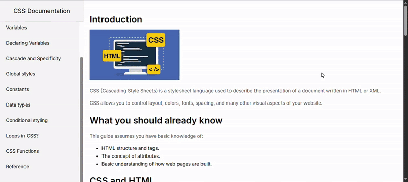

  
  

# CSS Documentation Page Project

---

## 🎯 Purpose

This project is a Technical Documentation Page created as part of freeCodeCamp's ["Build a Technical Documentation Page"](https://technical-documentation-page.freecodecamp.rocks/#Introduction) challenge. Its purpose is to present CSS fundamentals in a clean, accessible, and responsive layout, making it easy to learn and reference.

---

## 🛠 Technologies Used

- HTML5 → Used to create the structural layout of the page.

- CSS3 → Applied for design, typography, and responsive layout.

---

## 📚 What I Learned

- **Adding Fonts (Import via Google Fonts): ->**
  The most common way to add the Inter font to a project is by importing it through the link tag from Google Fonts. The steps for this method are as follows:
  1- Select the desired font from the [Google Fonts](https://fonts.google.com/) library.
  2- Add the link tag provided by Google Fonts to the head section of the HTML file:
  link href="https://fonts.googleapis.com/css2?family=Inter&display=swap" rel="stylesheet"
  3- Apply the font in the CSS file using the font-family property:
  body { font-family: 'Inter', sans-serif; }

- **pre (Preformatted Text) →**  
  Stands for "preformatted text". The text inside is displayed exactly as written; spaces, tabs, and line breaks are preserved. It is typically used to show code blocks or formatted text.

- **code (Code Text) →**  
  Stands for "code text". The text inside indicates that it is code, but alone the `code` tag does not preserve line breaks or spaces. It is typically used to show inline code.

  _When `pre` and `code` are used together, both the code block format is preserved and the fact that it is code is emphasized._

- **Using CSS transition →**

  - The `transition` property applies a CSS property change smoothly over a specified duration and easing curve instead of abruptly.
  - `background` → The CSS property to which the transition is applied.
  - `0.3s` → Duration of the transition (0.3 seconds).
  - `ease` → The animation's speed curve, meaning a smooth start and end.

  _It can be thought of like opening a door slowly with slight resistance on the hinge instead of opening it quickly. Transition makes CSS property changes occur smoothly and naturally._

- **Customizing Scroll Bar →**  
  Scrollbars can be customized using the CSS selectors `::-webkit-scrollbar`, `::-webkit-scrollbar-track`, and `::-webkit-scrollbar-thumb`. This allows for design-appropriate colors, rounded edges, and a more modern appearance.

  - `::-webkit-scrollbar` → Overall scrollbar area.
  - `::-webkit-scrollbar-track` → Background of the scroll path.
  - `::-webkit-scrollbar-thumb` → The scrollbar thumb itself.

- **vertical-align →**  
  When using the `code` tag inside a paragraph, the code text may appear slightly below or above other text on the line. Using `vertical-align: middle;` aligns the code to the middle of the text.

## 📷 Screenshot

