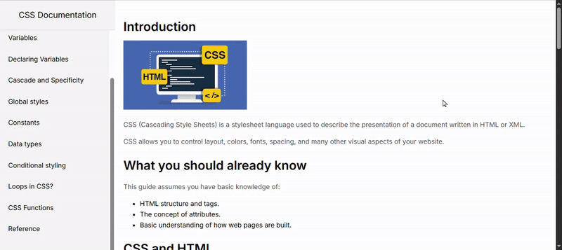

 

  
  

# CSS Documentation Page Project

---

## 🎯 Amaç

Bu proje, freeCodeCamp'in ["Build a Technical Documentation Page"](https://technical-documentation-page.freecodecamp.rocks/#Introduction) görevi kapsamında hazırlanmış bir Teknik Dokümantasyon Sayfasıdır. Amaç; CSS temellerini temiz, erişilebilir ve responsive bir düzen ile sunarak öğrenmeyi ve başvurmayı kolaylaştırmaktır.

---

## 🛠 Kullanılan Teknolojiler

- HTML5 → Sayfanın iskelet yapısını oluşturmak için kullanıldı.

- CSS3 → Tasarım, tipografi ve responsive düzen oluşturmak için uygulandı.

---

## 📚 Öğrendiklerim

- **Font ekleme (Google Fonts üzerinden import): ->**
  Inter fontu bir projeye eklemenin en yaygın yolu Google Fonts üzerinden link etiketiyle import etmektir. Bu yöntem için izlenecek adımlar şunlardır:

  1-[Google Fonts](https://fonts.google.com/) kütüphanesinden kullanılacak font seçilir.
  2-Google Fonts tarafından verilen link etiketi, HTML dosyasının head bölümüne eklenir:
  link href="https://fonts.googleapis.com/css2?family=Inter&display=swap" rel="stylesheet"
  3- Font, CSS dosyasında font-family özelliğiyle uygulanır:
  body { font-family: 'Inter', sans-serif; }

- **pre (Preformatted Text) ->** Açılımı: preformatted text yani “önceden formatlanmış metin”.
  İçine yazılan metin tam olarak yazıldığı gibi ekranda görünür; boşluklar, tablar ve satır atlamaları korunur. Genellikle kod blokları veya biçimlendirilmiş metin göstermek için tercih edilir.

- **code (Code Text) ->** Açılımı: code yani “kod metni”. İçine yazılan metin kod olduğunu belirtir, ama tek başına code satır atlamalarını veya boşlukları korumaz. Genellikle inline (satır içi) kod göstermek için kullanılır.

_pre ile code birlikte kullanıldığında hem kod bloğu formatı korunur, hem de kod olduğunun vurgusu yapılır._

- **CSS transition kullanımı →**

  - transition özelliği, bir CSS özelliğinin değişimini ani değil, belirlenen süre ve hız eğrisine göre uygulamaktır.
  - background → Geçişin uygulanacağı CSS özelliği.
  - 0.3s → geçişin süresi (0.3 saniye).
    ease → animasyonun hız eğrisi, yani başlangıç ve bitişin yumuşak olması.

  _bir kapıyı hızlıca açmak yerine menteşenin hafif bir dirençle kapıyı yavaşça açması gibi düşünülebilir. transition, CSS’deki özellik değişiminin ani değil, akıcı ve doğal bir şekilde gerçekleşmesini sağlar._

- **Scroll bar özelleştirme →**
  CSS ile `::-webkit-scrollbar`, `::-webkit-scrollbar-track` ve `::-webkit-scrollbar-thumb` seçicileri kullanılarak kaydırma çubukları özelleştirilebilir. Bu sayede tasarıma uygun renkler, yuvarlatılmış kenarlar ve daha modern bir görünüm elde edilir.

  - `::-webkit-scrollbar` → Scrollbar genel alanı.
  - `::-webkit-scrollbar-track` → Kaydırma yolunun arka planı.
  - `::-webkit-scrollbar-thumb` → Kaydırıcının kendisi.

- **vertical-align →**
  Paragraf içinde code etiketi kullanıldığında, kod metni bazen satırdaki diğer metinlere göre hafif aşağıda ya da yukarıda kalabilir. vertical-align: middle; kullanarak kodu metnin ortasına hizalayabiliriz.

---

## 📷 Ekran Görüntüsü

